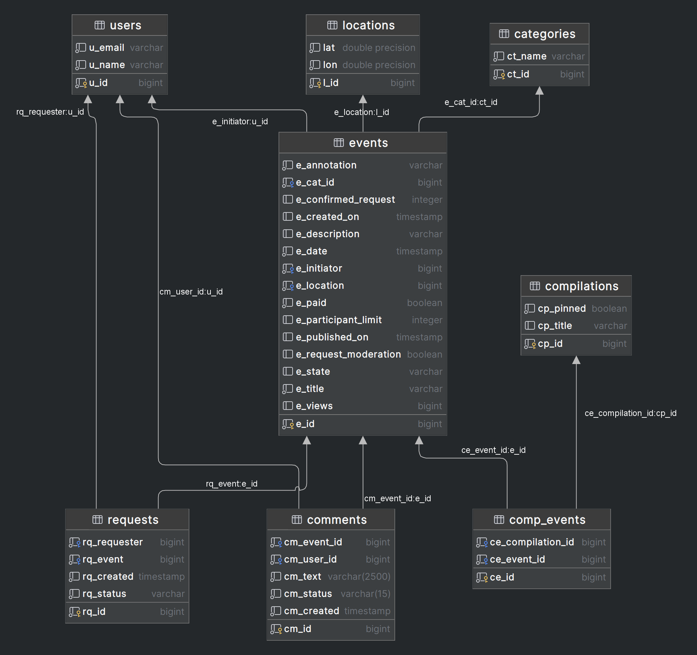
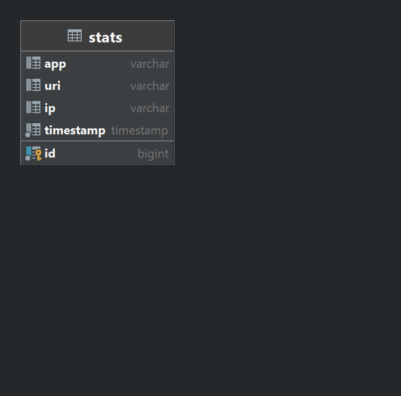

# java-explore-with-me
Template repository for ExploreWithMe project.

Ссылка на пул-реквест для проверки ветки develop [Pull-request](https://github.com/350StealthDelta/java-explore-with-me/pull/4#issue-1455256275)

Ссылка на пул-реквест для проверки ветки feature [Pull-request](https://github.com/350StealthDelta/java-explore-with-me/pull/5#issue-1484156670)

Базы данных.
1. *Структура базы данных для сервиса explore-server*
   
2. *Структура базы данных для сервиса explore-statEntity*
   
